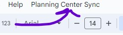
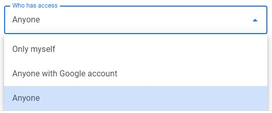

# Planning Center RemoteID Sync
This is a tool to synchronize PeopleID and RemoteID in Planning Center to allow for simplified bulk updates in Planning Center via the built-in Import/Export Tool

## Warnings
* This tool does not check for existing RemoteIDs. If you have them, you must make sure they do not overlap with PeopleIDs. I have no idea what will happen if they overlap, but I doubt it will be good.
* Organization Admins will not get RemoteIDs. Planning Center blocks updating Organization Admins via the APIs that this uses.

## How to Setup
1. [Open this Google Sheet](https://docs.google.com/spreadsheets/d/13MgPxryby493Eo3ijk-xBSJ5tzCOYyil2R3Yvdc2vY4/edit?usp=sharing) and make a copy 
1. Visit [Planning Center's Developer API Center](https://api.planningcenteronline.com/)
1. Click the New Personal Access API Token Button 
1. Give it whatever description you would like and make sure that the People drop down has 2023-02-15 selected in it. 
1. Submit it 
1. Copy the Application ID and Secret into the Google Sheet you copied in step 1.
1. Click the Planning Center Sync menu and select any option 
1. Select Continue 
1. Login with your Google Account
1. Click the little tiny Advanced Link 
1. Click the Go to Planning Center Sync (Unsafe) link 
1. Click Allow so that the spreadsheet can call the Planning Center API 
1. Configuration is now complete you can choose your favorite way to run this tool. (Note the Activity Log Sheet will give you additional feedback on what the tool is doing)

## Optional Features
### Daily updates via scheduled task
* You can choose to have this run once a day to keep new records up to date

### Realtime updates via Webhook
If you wish to have this run in realtime when new people are added in Planning Center you can do that via a webhook. Please follow these instructions to turn on the Webhook option.
1. In the Google Sheet select Extensions -> Apps Script 
1. In the top right select Deploy -> New deployment 
1. Click the Gear -> Web app 
1. Give it a descriptive name 
1. Change access to Anyone 
1. Click Deploy 
1. Copy the URL 
1. Click Done 
1. Go to the [Planning Center Webhooks API page](https://api.planningcenteronline.com/webhooks)
1. Click the Add button 
1. Paste in the Endpoint URL from Google 
1. Select Created under People -> Person 
1. Click Save 
1. That is all. Your Google Sheet will now update RemoteIDs in real time.